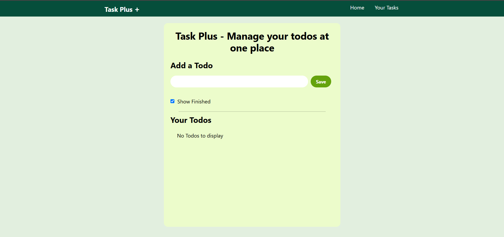
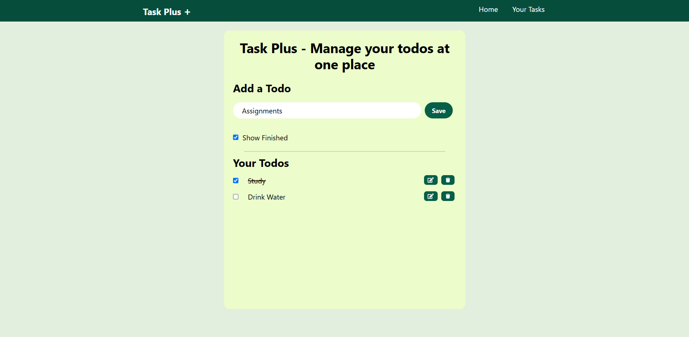

# 📝 Task Plus +

**Task Plus +** is a simple and elegant TODO list web app built with **React + Vite**. It helps users manage tasks efficiently with a clean UI and smooth UX.

> 🚀 Live Demo: [https://shaan-d21.github.io/TaskPlus-todo-app/](https://shaan-d21.github.io/TaskPlus-todo-app/)

---

## ✨ Features

- ✅ Add new tasks
- 📝 Edit existing tasks
- ❌ Delete tasks
- 📋 View your task list
- 📱 Fully responsive design
- ⚡ Built with **Vite** for lightning-fast performance

---

## 🛠️ Tech Stack

- **Frontend:** React, Vite
- **Deployment:** GitHub Actions + GitHub Pages

---

## 📦 Installation & Setup

Clone the repository:

```bash
git clone https://github.com/Shaan-d21/TaskPlus-todo-app.git
cd TaskPlus-todo-app
```
Install dependencies:
```bash
npm install
```

Run locally:
```bash
npm run dev
```

## 🚀 Deployment (GitHub Pages via GitHub Actions)
Deployment is handled automatically using GitHub Actions. On every push to the main branch, the app is built and deployed to the gh-pages branch.

To customize or debug the workflow, check the .github/workflows/deploy.yml file.

Make sure your vite.config.js includes the correct base path for GitHub Pages:
```js
export default defineConfig({
  base: '/TaskPlus-todo-app/',
  plugins: [react()],
});
```
## Screenshots



